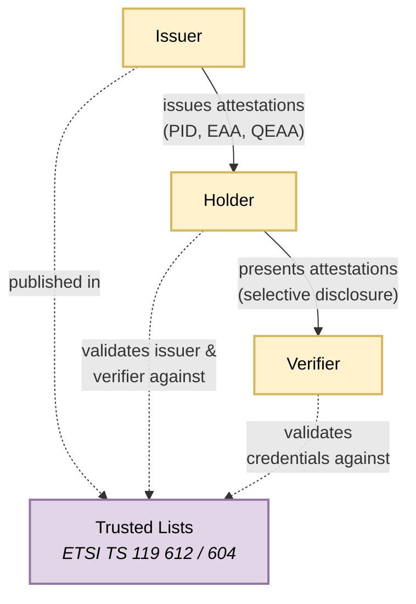
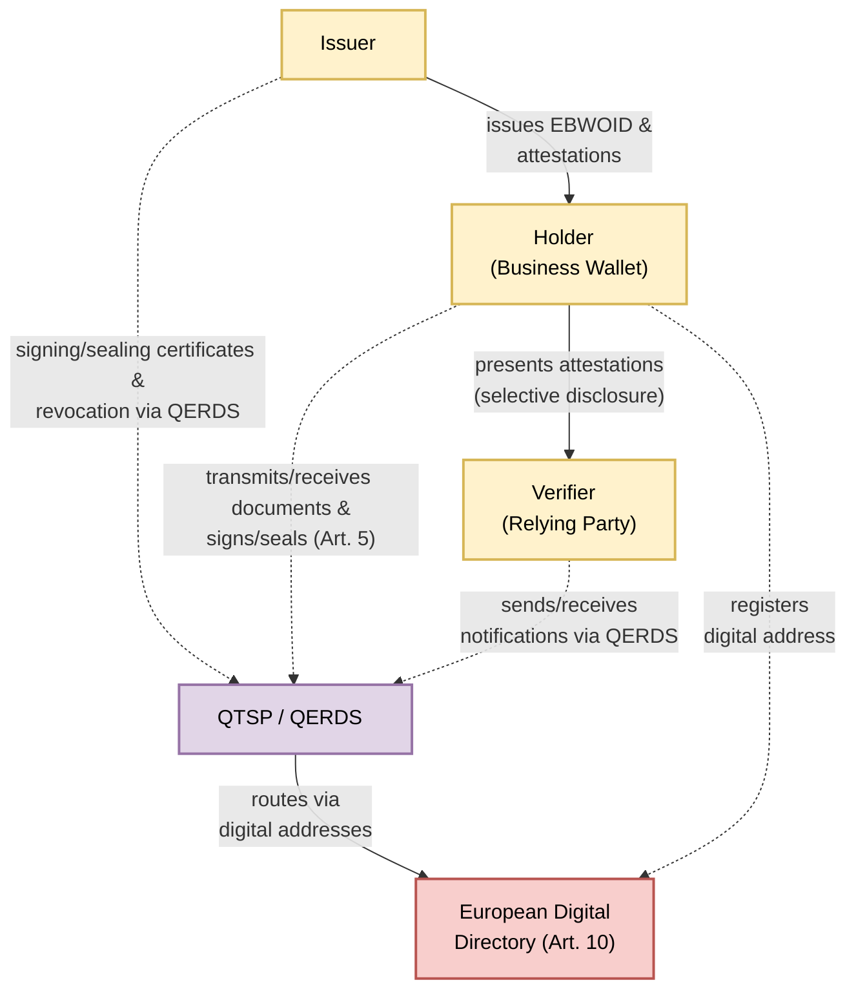

# Architecture Overview

## The Ecosystem at a Glance
The EU digital identity and EU business wallet ecosystem is an instance of the 3-party model for attestations. The core actors are:

1. **Holder** — the identity wallet controlled by either a natural or legal person. For natural persons this is the European Digital Identity Wallet (EUDIW) defined in Regulation (EU) No 910/2014 as amended; for economic operators and public sector bodies this is the European Business Wallet (EBW) established by Regulation (EU) 2025/2747.
2. **Issuer** — an entity that relies on authentic sources of information to issue electronic attestations of attributes to the holder's wallet. Issuer types include PID Providers, EBWOID Providers, QEAA Providers, PuB-EAA Providers, and non-qualified EAA Providers.
3. **Verifier** — a relying party (natural person, economic operator, or public sector body) that requests and receives attestations based on information present in the wallet.

The EU ecosystem for the natural person wallet is described in more detail in [ARF]. The European Business Wallet framework for legal persons is established by Regulation (EU) 2025/2747.

Several sources exist for describing the more general 3rd-party model, including ongoing work in the IETF eg [https://datatracker.ietf.org/doc/draft-ietf-spice-vdcarch/]

## System Landscape

The diagram below illustrates the baseline trust topology of the EU wallet ecosystem.

#### Actors

| Actor | Description |
|-------|-------------|
| **Issuer** | An entity that relies on authentic sources to issue electronic attestations of attributes to the holder. Issuers include PID Providers, QEAA Providers, PuB-EAA Providers, and non-qualified EAA Providers. Each issuer is registered in the applicable trusted list and holds an access certificate issued by an Access Certificate Authority. |
| **Holder** | The identity wallet controlled by a natural or legal person. The holder securely stores attestations received from issuers and selectively presents them to verifiers under the holder's sole control. In the baseline topology the holder is a European Digital Identity Wallet; in the WE BUILD topology it is a European Business Wallet. |
| **Verifier** | A relying party (natural person, economic operator, or public sector body) that requests and receives attestations from the holder. The verifier must be registered with its Member State Registrar and holds an access certificate that the holder's wallet evaluates before presenting any data. |
| **Trusted Lists** | The EU trust framework defined under ETSI TS 119 612 and ETSI TS 119 604. A hierarchical structure of trusted lists compiled and published by the European Commission (EU-level) and Member State Trusted List Providers (national level). The List of Trusted Lists (LoTL) references individual trusted lists that contain cryptographic trust anchors, service status, and authorised attestation types for all registered providers. |

#### Relationships

| From | To | Relationship | Description |
|------|----|-------------|-------------|
| Issuer | Holder | **Issues attestations (PID, EAA, QEAA)** | The issuer creates and delivers electronic attestations of attributes to the holder's wallet using the OpenID4VCI protocol. Attestation types include Person Identification Data (PID), Qualified Electronic Attestations of Attributes (QEAA), and non-qualified Electronic Attestations of Attributes (EAA). |
| Holder | Verifier | **Presents attestations (selective disclosure)** | The holder selectively discloses attestation data to the verifier using the OpenID4VP protocol. The holder maintains sole control over which attributes are shared and requires user consent before each presentation. Selective disclosure is supported via SD-JWT. |
| Issuer | Trusted Lists | **Published in** | The issuer's trust anchors, service type, status (granted, suspended, withdrawn), and authorised attestation types are published in the applicable trusted list. PID Providers appear in EU-level trusted lists compiled by the European Commission; QEAA Providers appear in Member State trusted lists per eIDAS Article 22. |
| Holder | Trusted Lists | **Validates issuer & verifier against** | Before requesting attestations from an issuer, the wallet evaluates the issuer against the applicable trusted list. Before presenting attestations to a verifier, the wallet evaluates the verifier's access certificate against the Access CA trusted list. This ensures the holder only interacts with authorised parties. |
| Verifier | Trusted Lists | **Validates credentials against** | Upon receiving attestations, the verifier validates the issuer's signatures and trust anchors against the applicable trusted list. For PID and LPID this is the EU-level PID Provider trusted list; for QEAA it is the Member State QTSP trusted list; for PuB-EAA and non-qualified EAA it is the respective Attestation Provider trusted list. Validation follows ETSI TS 119 615 procedures. |

---

In the WE BUILD project the focus is primarily on wallets for legal entities. In this case the regulation (Regulation (EU) 2025/2747) includes the use of qualified electronic registered delivery services to enable messaging services between entities in the ecosystem. Accordingly, the generic trust anchor is replaced by a Qualified Trust Service Provider operating a Qualified Electronic Registered Delivery Service (QTSP/QERDS), through which issuers, holders, and verifiers route their trust and messaging interactions. The European Digital Directory (Article 10) provides digital addressing for secure routing of documents and notifications. The diagram changes to this:

#### Actors

| Actor | Description |
|-------|-------------|
| **Issuer** | In the business wallet context, the issuer issues European Business Wallet Owner Identification Data (EBWOID) and electronic attestations of attributes to the holder. Providers of EBWOID include qualified trust service providers, public sector bodies, or the European Commission (Regulation (EU) 2025/2747, Article 8). |
| **Holder (Business Wallet)** | A European Business Wallet controlled by an economic operator or public sector body. It securely stores, manages, and presents EBWOID and electronic attestations of attributes. Core functionalities include identification, authentication, signing/sealing, document exchange via QERDS, and selective disclosure (Article 5). |
| **Verifier (Relying Party)** | An economic operator or public sector body that relies upon the European Business Wallet to request and validate EBWOID and electronic attestations of attributes. Public sector bodies are required to accept European Business Wallets for identification, authentication, signing, document submission, and notifications (Article 16). |
| **QTSP / QERDS** | A Qualified Trust Service Provider operating a Qualified Electronic Registered Delivery Service. The QERDS transmits electronic documents and data with legal evidence of handling, supporting confidentiality and integrity (Article 5(1)(i)). The QTSP also provides qualified electronic signatures, seals, and time stamps. Wallet providers must enable QERDS as a standalone service accessible to EUDIW users as well (Article 5(3)). |
| **European Digital Directory (Art. 10)** | A trusted source of information for European Business Wallet owners, established and maintained by the European Commission (Article 10). It provides a machine-readable API for system-to-system communication and a web-based portal for authenticated users. Each wallet is assigned at least one unique digital address for QERDS routing (Article 6(j)). |

#### Relationships

| From | To | Relationship | Description |
|------|----|-------------|-------------|
| Issuer | Holder | **Issues EBWOID & attestations** | The issuer creates and delivers EBWOID and electronic attestations of attributes to the business wallet. EBWOID contains at minimum the official name and a unique identifier of the economic operator (Article 8(5)). EBWOID has the same legal effect as qualified electronic attestations of attributes issued by a public sector body (Article 8(4)). |
| Holder | Verifier | **Presents attestations (selective disclosure)** | The business wallet owner selectively discloses EBWOID and attestation attributes to the relying party. The wallet enables selective disclosure so that only the attributes required for a specific transaction are shared (Article 5(1)(b)). |
| Issuer | QTSP/QERDS | **Signing/sealing certificates & revocation via QERDS** | The issuer obtains qualified certificates for electronic signatures and seals from the QTSP. When attestations are revoked, the issuer notifies the holder via the QERDS secure channel, providing legal evidence of the notification. |
| Holder | QTSP/QERDS | **Transmits/receives documents & signs/seals (Art. 5)** | The business wallet transmits and receives electronic documents and data via the QERDS with legal evidence of handling (Article 5(1)(i)). The wallet owner also creates qualified electronic signatures and seals through the QTSP (Article 5(1)(d)), and accesses a common dashboard for communications exchanged through QERDS (Article 5(1)(n)). |
| Verifier | QTSP/QERDS | **Sends/receives notifications via QERDS** | The relying party sends notifications, decisions, and requests to economic operators via the QERDS. Public sector bodies must enable economic operators to send/receive notifications using the QERDS (Article 16(4)(d)). The QERDS provides legal evidence of handling for all transmitted data. |
| QTSP/QERDS | Directory | **Routes via digital addresses** | The QERDS uses the European Digital Directory to resolve unique digital addresses for routing documents and notifications to the correct business wallet instance. |
| Holder | Directory | **Registers digital address** | Upon provisioning, providers of European Business Wallets submit wallet information to the European Commission for inclusion in the European Digital Directory (Article 10(2)). Each wallet is assigned at least one unique digital address for QERDS purposes (Article 6(j)). |

## Common Rules for Everyone
Security, error handling, auditability, portability.

## Wallet Implementation Models 
To be authored by Wallet Group. Describes the techn stacks, such as cloud-based vs. device-based solutions, and the differences between EUDIW for Natural Person and European Business Wallets for  economic operators.
### The EUDI Wallet for Natural Person
To come: [Issue 63](https://github.com/webuild-consortium/wp4-architecture/issues/63) will produce concept model in collaboration with Wallet Group.
### The Business Wallet for Economic Operators
To come: [Issue 63](https://github.com/webuild-consortium/wp4-architecture/issues/63) will produce concept model in collaboration with Wallet Group.
