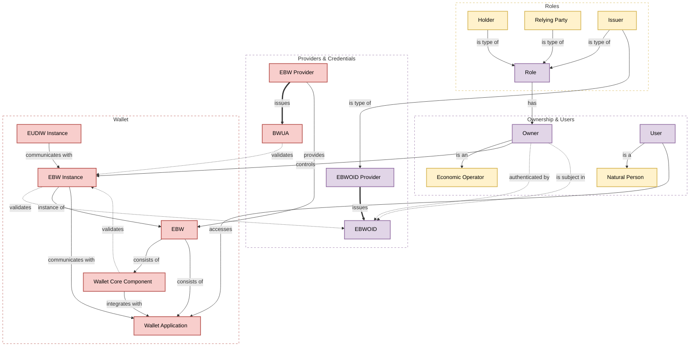

# Mermaid Rendering Test

Testing subgraph styling, edge types, and classDef support in GitHub markdown.

## Test: EBW Concept Model

```mermaid
%% European Business Wallet concept model for economic operators
flowchart TB
    %% --- Row 1: Roles ---
    subgraph roles ["Roles"]
        direction LR
        H["Holder&nbsp;&nbsp;"]
        RP["Relying Party&nbsp;&nbsp;"]
        I["Issuer&nbsp;&nbsp;"]
        R["Role&nbsp;&nbsp;"]
    end

    %% --- Row 2: Ownership & Users ---
    subgraph ownership ["Ownership & Users"]
        direction LR
        O["Owner&nbsp;&nbsp;"]
        EO["Economic Operator&nbsp;&nbsp;"]
        U["User&nbsp;&nbsp;"]
        NP["Natural Person&nbsp;&nbsp;"]
    end

    %% --- Row 3: Providers & Credentials ---
    subgraph providers ["Providers & Credentials"]
        direction LR
        EP["EBWOID Provider&nbsp;&nbsp;"]
        EID["EBWOID&nbsp;&nbsp;"]
        EBP["EBW Provider&nbsp;&nbsp;"]
        BW["BWUA&nbsp;&nbsp;"]
    end

    %% --- Row 4: Wallet ---
    subgraph wallet ["Wallet"]
        direction LR
        EBI["EBW Instance&nbsp;&nbsp;"]
        EUDI["EUDIW Instance&nbsp;&nbsp;"]
        EBW["EBW&nbsp;&nbsp;"]
        WCC["Wallet Core Component&nbsp;&nbsp;"]
        WA["Wallet Application&nbsp;&nbsp;"]
    end

    %% Type relationships (solid)
    H -->|is type of| R
    RP -->|is type of| R
    I -->|is type of| R
    I -->|is type of| EP

    %% Ownership relationships (solid)
    R -->|has| O
    O -->|is an| EO
    U -->|is a| NP
    O -->|controls| EBI

    %% Issuance (thick)
    EP ==>|issues| EID
    EBP ==>|issues| BW
    EBP -->|provides| EBW

    %% Authentication & validation (dashed)
    O -.->|authenticated by| EID
    O -.->|is subject in| EID
    EBI -.->|validates| EID
    BW -.->|validates| EBI
    WCC -.->|validates| EBI

    %% Wallet structure (solid)
    EBI -->|instance of| EBW
    EBW -->|consists of| WCC
    EBW -->|consists of| WA
    WCC -->|integrates with| WA

    %% User & cross-wallet interaction (solid)
    U -->|accesses| WA
    EBI -->|communicates with| WA
    EUDI -->|communicates with| EBI

    %% Styling
    classDef primaryRole fill:#fff2cc,stroke:#d6b656,stroke-width:2px,color:#000;
    classDef component fill:#e1d5e7,stroke:#9673a6,stroke-width:2px,color:#000;
    classDef walletPart fill:#f8cecc,stroke:#b85450,stroke-width:2px,color:#000;

    class H,RP,I,EO,NP primaryRole;
    class R,O,U,EP,EID component;
    class EBP,BW,EBW,WCC,WA,EBI,EUDI walletPart;

    %% Subgraph styling
    style roles fill:none,stroke:#d6b656,stroke-width:1px,stroke-dasharray: 5 5
    style ownership fill:none,stroke:#9673a6,stroke-width:1px,stroke-dasharray: 5 5
    style providers fill:none,stroke:#9673a6,stroke-width:1px,stroke-dasharray: 5 5
    style wallet fill:none,stroke:#b85450,stroke-width:1px,stroke-dasharray: 5 5
```
